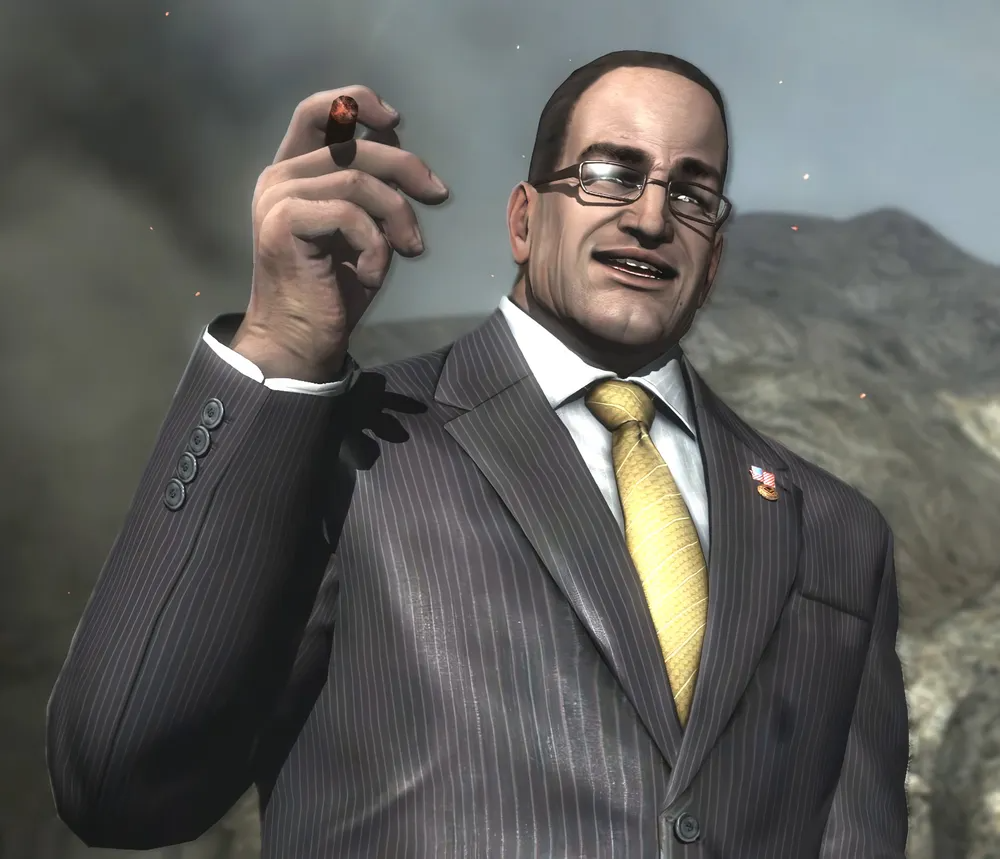

+++
title = "요즘 방구석에 이상한 그늘이 져"
date = 2026-07-06T20:00:00+09:00
tags = ["일상", "잡담", "고민", "괴담"]
enableComments = true
authorComment = "스티븐 암스트롱(메탈기어 라이징 리벤전스), 벨라(트릭컬 리바이브), oiiaoiia cat, 괴담에 떨어져도 출근을 해야 하는구나\n"
commentTitle = "조여주는 댓글"
commentPlaceholder = "-..  .-  -  --.  .-.."

[[commentList]]
author = "김 봉"
date = "2026-07-06 20:12"
text = "봉봉 봉 오봉 봉봉봉봉봉 오보오오옹 보봉봉 보오오옹"
color = "#ffcc00"

[[commentList]]
author = "기린"
date = "2026-07-06 20:18"
text = "헐... 나도 자취할 때 형광등 깜빡이면서 구석에 그림자 진 적 있었는데. 그거 절대 뒤돌아보면 안 됨 ㅠㅠ"
color = "#666"

[[commentList]]
author = "스티븐 로거스"
date = "2026-07-06 20:35"
text = "다행이다!! 아무 일도 없었던 거네 ㅋㅋㅋ 과로하면 진짜 헛것 보임. 오늘은 따뜻한 물 마시고 일찍 자라~"
color = "#33ff33"
+++


요즘 들어서 내 방 구석에 자꾸 이상한 그림자가도 망 쳐 지는 것 같아.

처음엔 그냥 형광등 불빛이 약해져서 그런가보다 했는데,
밤에 누워있을 때마다 그 그늘이 조금씩보 지 마 내 쪽으로 다가오는 느낌이 들어.

기분 탓이겠지?
어제는 분명히 책장 옆에만 있던 그늘이, 오늘 아침에 보니까 침대 밑까지 내려왔더라고.

방금도 등 뒤에서 부스럭거리는 소리뒤 돌아 보 지 마가 나서 돌아봤는데 아무것도 없었어.

그런데 화면을 보고 있는 지금, 

  모니터에 비친 내 뒤에...

 

  

그것은 단순한 등장이 아니었습니다. 인간의 형상을 빌린 재앙이자, 대지를 짓누르는 거대한 성벽의 강림이었습니다. 자욱한 화약 연기를 가르며 나타난 실루엣은 전장의 공기를 얼어붙게 만들었고, 칼같이 재단된 회색 핀스트라이프 슈트조차 터져 나갈 듯한 강철 같은 육체를 감추지 못했습니다. 시가를 깊게 빨아들이는 눈동자에는 망설임 대신, 세상을 재편하겠다는 절대적인 확신만이 번뜩였습니다.

그가 발걸음을 내딛을 때마다 잔해가 짓밟히며 대지가 진동했습니다. 그것은 파괴가 아니라 선언이었습니다. 비열하면서도 당당한 미소로 모든 위압감을 홀로 흡수하는 그 존재감은, 이미 완성된 승리의 확신 그 자체였습니다.

결론적으로 스티븐 암스트롱, 그가 발을 디딘 그곳은 더 이상 단순한 폐허가 아니었습니다. 새로운 시대를 독점하려는 거인의 무자비한 전장, 그 자체였습니다.


